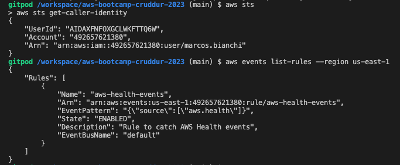
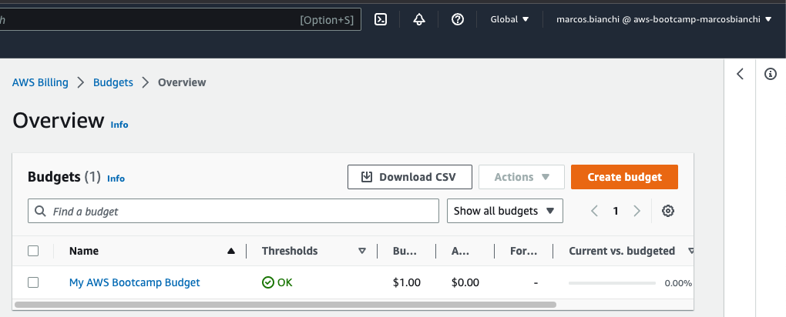
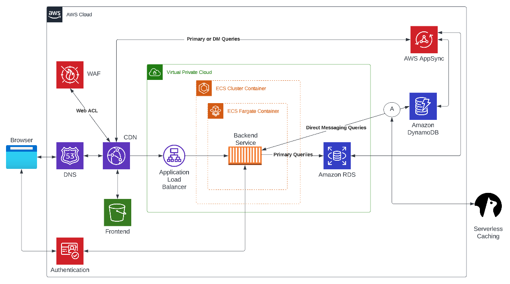
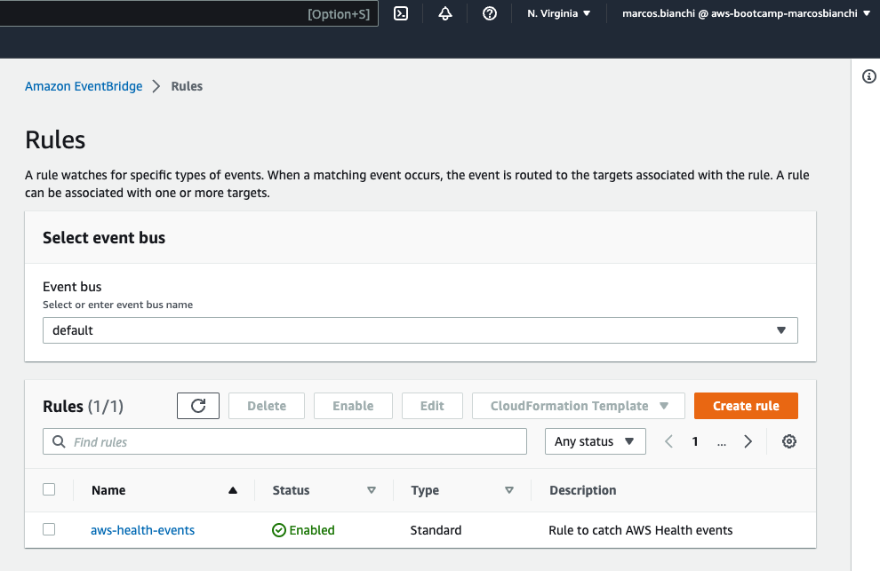
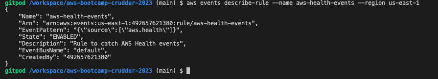
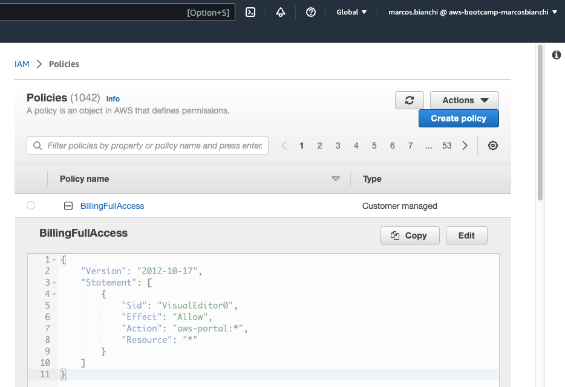

# Week 0 — Billing and Architecture

## Required Homework/Tasks

### Install and Verify AWS CLI 

After adding config in gitpod.yml, showed identity and listed EventBridge rules from a terminal 

### Create a Budget

Created a Zero Spend Budget ($1) because I want to be alerted as soon as any service crosses the free tier limits.

Added a Policy to allow my admin user to access Budgets (see [Allow Billing Access to my Admin User](week0.md#allow-billing-access-to-my-admin-user))

### Recreate Logical Architectural Design

Introduced a change in the frontend part, assuming that server side processing is not needed and it can be served from an S3 bucket. Access to this bucket is restricted to only the CDN.
Using a CDN we can improve the end user experience by making access to our application more "locally".

## Homework Challenges

### Added AWS WAF service 

Frontend served through the CDN is protected by an AWS WAF Web ACL that inspects and manages web requests. It can block them based on a specified criteria.

### Create EventBridge rule 

Created an event rule in the default event bus that catches all AWS Health events and added an SNS Topic as a target to send emails each time the rule triggers.

### Allow Billing Access to my Admin User

Steps:
1. Created a BillingFullAccess policy for my admin user marcos.bianchi
2. Created user group "billing-admins" and attached previous policy
3. Added my user marcos.bianchi to the previous group

Followed this guide:
[IAM tutorial: Delegate access to the billing console](https://docs.aws.amazon.com/IAM/latest/UserGuide/tutorial_billing.html?icmpid=docs_iam_console#tutorial-billing-step2)

